# Decodificador de Texto

<ul> <h1>Tecnologias utilizadas</h1> 
<li> HTML</li>
<li> CSS</li>
<li> JAVASCRIPT</li>
</ul>

# Índice
<ul>
<li><a href=""> Visão Geral</a> </li>
<li><a href=""> Estrutura de Arquivos</a> </li>
<li><a href=""> HTML (index.html)</a> </li>
<li><a href=""> CSS (style.css)</a> </li>
<li><a href=""> JavaScript (script.js)</a> </li>
<li><a href=""> Contribuição</a> </li>
<li><a src=".licenca"> Licença</a> </li>
</ul>

# Visão Geral

 O projeto consiste em uma interface web que permite ao usuário inserir texto em uma área de texto e escolher entre criptografar ou descriptografar a mensagem. A criptografia é realizada substituindo certas letras por sequências de caracteres predefinidas, e a descriptografia inverte este processo.  

# Estrutura de Arquivos

 
<li> index.html:  Estrutura HTML da página. </li>
<li> style.css: Estilos CSS aplicados à página. </li>
<li>script.js: Funções JavaScript que controlam a lógica de criptografia, descriptografia e validação do texto.</li>
 

# HTML (index.html)
 

<li> O arquivo index.html define a estrutura da página web e inclui os seguintes elementos principais: </li>
<li>Cabeçalho (header): Contém o logotipo da Alura e um título oculto.</li>
 
<li>Área Principal (main): Dividida em duas seções:<ul>
<li> Esquerda (container__left): Inclui um textarea para entrada de texto, uma área de validação para exibir mensagens de erro, e três botões para criptografar, descriptografar e recarregar a página.</li>
</ul>
<ul>
<li>Esquerda (container__left): Inclui um textarea para entrada de texto, uma área de validação para exibir mensagens de erro, e três botões para criptografar, descriptografar e recarregar a página.</li>
</ul>
<li> Rodapé (footer): Contém informações de autoria e links para os perfis do GitHub e LinkedIn. </li>
 

# Estrutura Básica do HTML
 

<ul>
<li>Textarea: Área onde o usuário digita o texto a ser criptografado ou descriptografado.</li>
<li>Botões: Botões para acionar as funções de criptografia, descriptografia e recarregamento da página.</li>
<li>Resultado: Área onde o texto processado é exibido.</li>
</ul>
 

# CSS (style.css)
 

O arquivo style.css define a aparência e o layout da página. A seguir estão alguns detalhes importantes:

<ul>
<li>Estilo Global: Reseta margens e preenchimentos, define fontes padrão e cores através de variáveis CSS.</li>
<li>Layout Responsivo: Usa @media queries para ajustar o layout em diferentes tamanhos de tela (e.g., 768px e 480px).</li>
<li>Container Principal: Define a disposição flexível das seções esquerda e direita.</li>
<li>Botões: Estilos personalizados para os botões, incluindo efeitos de hover.</li>
</ul>
 

# Principais Componentes de Estilo
 

<ul>
<li>: Define variáveis de cor e fonte.</li>
<li>.container: Organiza a estrutura principal em duas colunas.</li>
<li>Botões: Customizados para diferentes estados (normal e hover) e tamanhos de tela.</li>
<li>Responsividade: Adapta o layout para dispositivos móveis, reduzindo o tamanho dos elementos e reorganizando a disposição.</li>
</ul>
 

# O codificador Responsivo

## Desktop

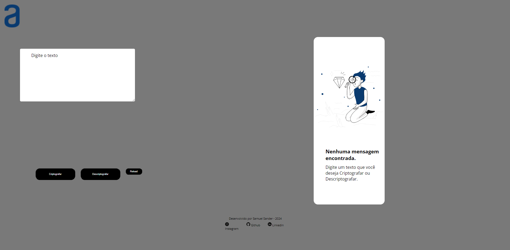

## Tablet

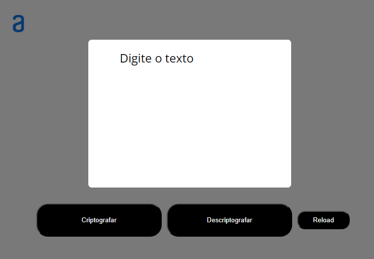

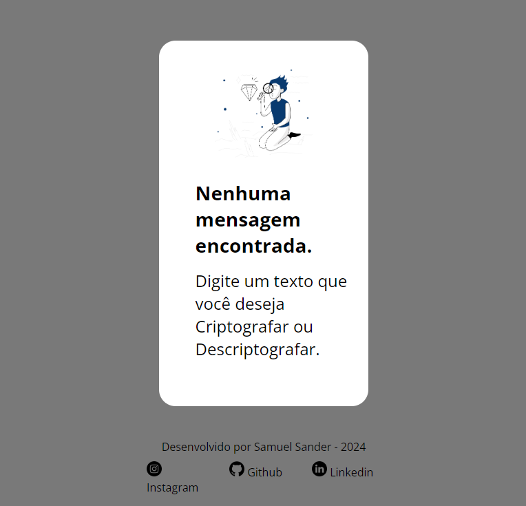

## Mobile

 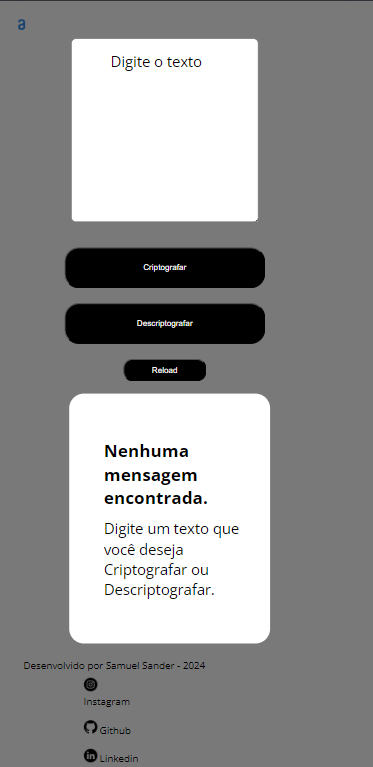 

# Como Usar

<ol>
    <li> Digite o texto que deseja criptografar ou descriptografar na área de texto à esquerda.</li>
    <li> Clique no botão "Criptografar" ou "Descriptografar".</li>
    <li> O resultado será exibido na área à direita.</li>
    <li> Se desejar, copie o texto criptografado/descriptografado clicando no botão "Copiar".</li>
    <li> Use o botão "Reload" para limpar o campo de texto e a área de resultado.</li>  
</ol>

# Documentação do Código JavaScript

Este documento fornece uma explicação detalhada do código JavaScript utilizado para criptografar e descriptografar texto em uma página web. O código também inclui funcionalidades de validação de entrada, cópia de texto para a área de transferência, e atualização de elementos da interface do usuário com base no conteúdo do texto.

## Índice

<ol>
    <li>Descrição dos Elementos do DOM </li>
    <li>Funções de Criptografia e Descriptografia</li>
    <li>Funções de Validação e Mensagem</li>
    <li>Funções de Interação com a Página</li>
    <li> Eventos e Atualizações de Interface</li>
    <li> Função de Recarregar e Limpar Texto </li>
<ol>

## Descrição dos Elementos do DOM

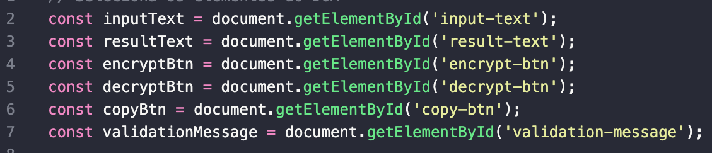

Estes elementos do DOM são selecionados usando getElementById para manipulação posterior:

<ul>
    <li>inputText: campo de entrada de texto.</li>
    <li>resultText: área onde o texto criptografado ou descriptografado é exibido.</li>
    <li>encryptBtn: botão para criptografar o texto.</li>
    <li>decryptBtn: botão para descriptografar o texto.</li>
    <li>copyBtn: botão para copiar o texto resultante para a área de transferência.</li>
    <li>validationMessage: área para exibir mensagens de validação.</li>
</ul>

## Funções de Criptografia e Descriptografia

### Função de Criptografia

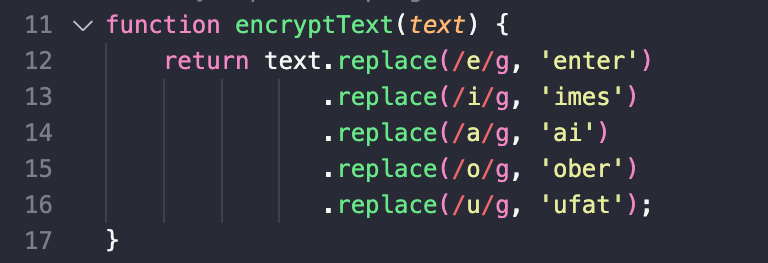

Esta função substitui caracteres específicos no texto de entrada por sequências predeterminadas para criptografá-lo.

### Função de Descriptografia

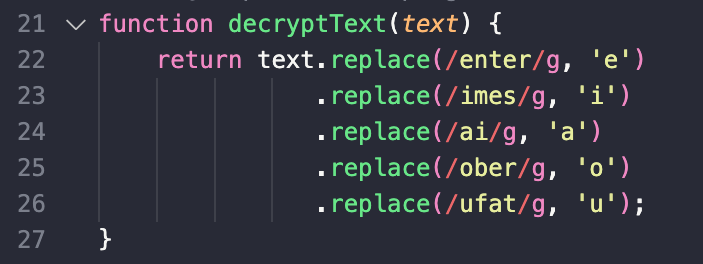

Esta função reverte o processo de criptografia, substituindo as sequências criptografadas pelos caracteres originais.

## Funções de Validação e Mensagem

### Função de Validação de Texto

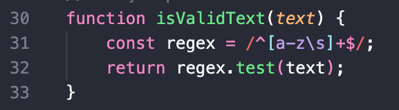

 Verifica se o texto contém apenas letras minúsculas e espaços.

### Função para Exibir Mensagem de Validação

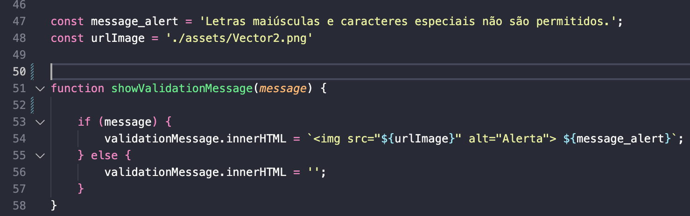

Exibe uma mensagem de validação com um ícone de alerta quando o texto contém caracteres inválidos.

## Funções de Interação com a Página

###  Função para Copiar Texto

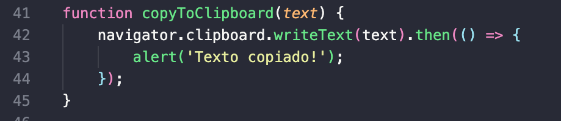

Copia o texto fornecido para a área de transferência e exibe um alerta.

### Função para Atualizar Elementos com Base no Texto

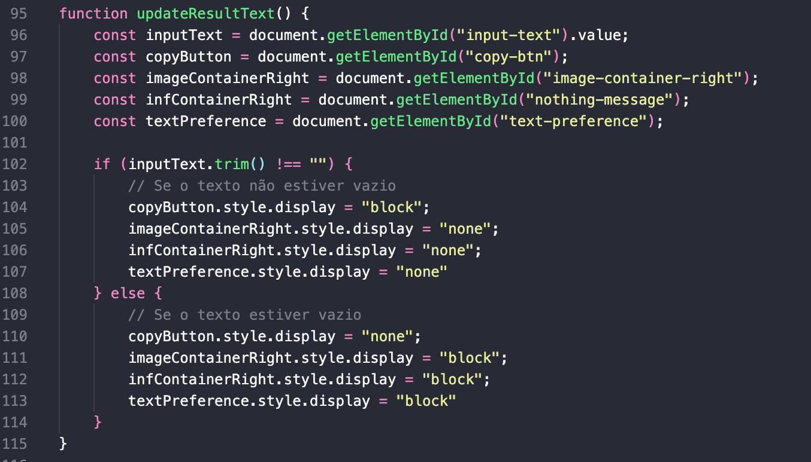

Atualiza a visibilidade de elementos na interface com base no conteúdo do campo de entrada de texto.

## Eventos e Atualizações de Interface

### Evento de Criptografia

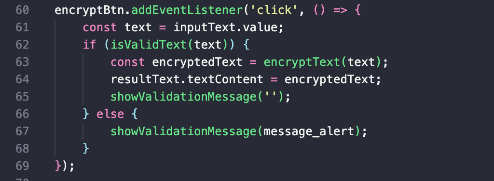

Adiciona um evento de clique ao botão de criptografia, criptografando o texto de entrada se for válido.

### Evento de Descriptografia

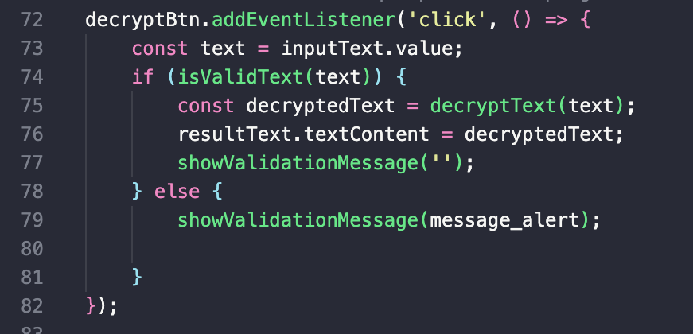

Adiciona um evento de clique ao botão de descriptografia, descriptografando o texto de entrada se for válido.

### Evento de Cópia de Texto

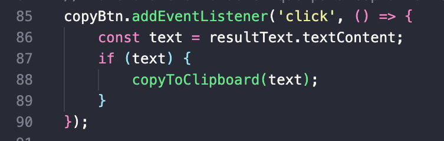

Adiciona um evento de clique ao botão de copiar, copiando o texto resultante para a área de transferência.

### Evento para Atualização Inicial

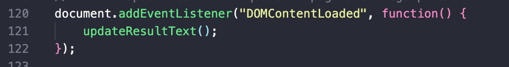

Chama a função updateResultText quando a página é carregada para definir os estados iniciais dos elementos.

## Função de Recarregar e Limpar Texto

### Função para Recarregar a Página

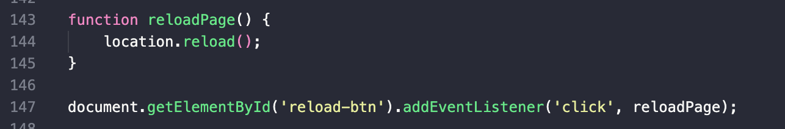

Recarrega a página quando o botão de recarregar é clicado.

### Função para Limpar Texto

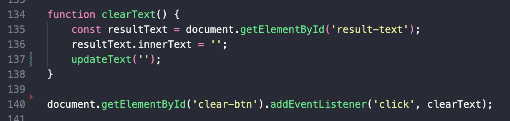

Limpa o texto exibido e chama updateText para atualizar a interface.

### Chamada de Função ao Carregar a Página

Chama a função checkTextAndToggleImage quando a página é carregada, para garantir que os elementos da interface estejam corretamente atualizados.

#### 
Esta documentação detalha cada parte do código JavaScript, proporcionando uma compreensão clara das funcionalidades implementadas e como elas interagem com a interface do usuário.

# Contribuição

 Sinta-se à vontade para contribuir com melhorias no código ou na documentação. Fork este repositório e envie um pull request com suas alterações. 

